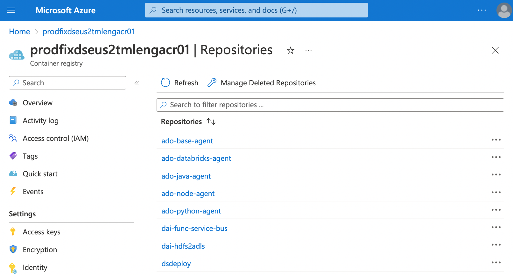

#   Push Docker images to Azure Container Registry

A Key Vault access policy determines whether a given security principal, namely a user, application or user group, can perform different operations on Key Vault secrets, keys, and certificates.

Key vault supports up to 1024 access policy entries, with each entry granting a distinct set of permissions to a particular security principal.


##  Here are steps to  push Docker images to Azure Container Registry (ACR)

  
 - Step 1 : List all running Docker images
 
`docker ps`

Result:

```
CONTAINER ID   IMAGE                      COMMAND       CREATED             STATUS             PORTS     NAMES
64d262a4d010   dai-func-service-bus:1.0   "/bin/bash"   About an hour ago   Up About an hour             awesome_burnell
```

 - Step 2 : List all running Docker containers and pick the one you want to push to ACR
 
`docker images`

Result:

```
REPOSITORY                    TAG       IMAGE ID       CREATED             SIZE
dai-func-service-bus          1.0       f705770c0651   About an hour ago   619MB
dai-func-sp-secret-created    1.0       7cd8ea7f3884   8 days ago          739MB
dai-func-sp-secret-expiring   1.1       7b1c8a1f34c6   13 days ago         738MB
dai-func-sp-secret-expiring   1.0       6e5ea1403dff   2 weeks ago         738MB
docker101tutorial             latest    f31889622667   4 weeks ago         46.5MB
alpine/git                    latest    9793ee61fc75   2 months ago        43.4MB
hello-world                   latest    46331d942d63   10 months ago       9.14kB
```

 - Step 3 : Login to Azure Container Registry
 
`az acr login --name prodfixdseus2tmlengacr01`

Result:

```
Login Succeeded
```

 - Step 4 : Get the loginServer name of the Azure Container Registry
 
 
 We need resource group `prodfix-ds-tmleng-eastus2-rg-01` to retrieve loginServer name
 
`az acr list --resource-group prodfix-ds-tmleng-eastus2-rg-01 --query "[].{acrLoginServer:loginServer}" --output table`

Result:

```
AcrLoginServer
-----------------------------------
prodfixdseus2tmlengacr01.azurecr.io
```


 - Step 5 : Tag the Docker images
 
In order to push Docker images to Azure Container Registry, we need to tag the images with the loginServer name of the Registry and the tags are used for routing purposes


In this case, we want to push `dai-func-service-bus:1.0` image to ACR and tag it to `prodfixdseus2tmlengacr01.azurecr.io/dai-func-service-bus:v1`

`docker tag dai-func-service-bus:1.0 prodfixdseus2tmlengacr01.azurecr.io/dai-func-service-bus:v1 `

 - Step 6 :  List all running Docker containers again

We will see the tagged Docker images `prodfixdseus2tmlengacr01.azurecr.io/dai-func-service-bus`
`docker images`


```
REPOSITORY                                                 TAG       IMAGE ID       CREATED             SIZE
dai-func-service-bus                                       1.0       f705770c0651   About an hour ago   619MB
prodfixdseus2tmlengacr01.azurecr.io/dai-func-service-bus   v1        f705770c0651   About an hour ago   619MB
dai-func-sp-secret-created                                 1.0       7cd8ea7f3884   8 days ago          739MB
dai-func-sp-secret-expiring                                1.1       7b1c8a1f34c6   13 days ago         738MB
dai-func-sp-secret-expiring                                1.0       6e5ea1403dff   2 weeks ago         738MB
docker101tutorial                                          latest    f31889622667   4 weeks ago         46.5MB
alpine/git                                                 latest    9793ee61fc75   2 months ago        43.4MB
hello-world                                                latest    46331d942d63   10 months ago       9.14kB
```

 - Step 7 : Push Docker Images to Azure Container Registry

`docker push prodfixdseus2tmlengacr01.azurecr.io/dai-func-service-bus:v1`

Result:

```
The push refers to repository [prodfixdseus2tmlengacr01.azurecr.io/dai-func-service-bus]
d02eaeabb3c0: Pushed 
6247d791352e: Pushed 
7f5598734951: Pushed 
f9c7f00aa561: Pushed 
4fc39c6a35fc: Pushed 
0219d3d7fa6e: Pushed 
5f70bf18a086: Pushed 
5fe4ff93a619: Pushed 
e21de659be2f: Pushed 
1207054020ee: Pushed 
a76be9efdb17: Pushed 
ee208316b1de: Pushed 
aa621ecc8262: Pushed 
85cbe3c3bbc1: Pushed 
b33ff346ea32: Pushed 
1e70059397e5: Pushed 
afd7e44a4e08: Pushed 
v1: digest: sha256:9cdbee15989a371e8abf3c36db61753c3d4bf68622ba15d09c2ee03418c05abb size: 3881
```


 - Step 8 : Check if Docker image `dai-func-service-bus` is in Azure Container Registry `prodfixdseus2tmlengacr01`
 
`az acr repository list --name  prodfixdseus2tmlengacr01 --output table`

Result:

```
Result
--------------------
ado-base-agent
ado-databricks-agent
ado-java-agent
ado-node-agent
ado-python-agent
dai-func-service-bus
dai-hdfs2adls
dsdeploy
```

 - Step 9 : Check Docker image `dai-func-service-bus` in the Azure Container Registry `prodfixdseus2tmlengacr01`
  
   
  
  
   
  


Reference:
- https://koukia.ca/push-docker-images-to-azure-container-registry-ed21facefd0c
